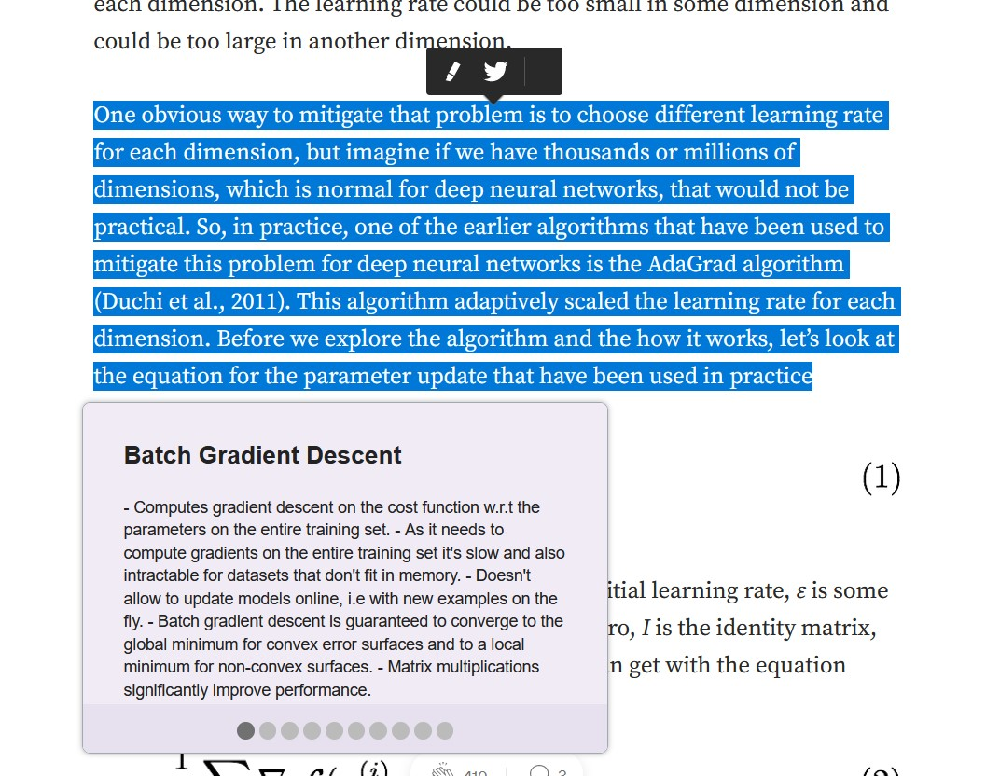

# Progress Report

## Members
- Ashwin Patil (anpatil2@illinois.edu)

## Questions
### 1) Which tasks have been completed? Which tasks are pending?
- [x] Mozilla Firefox Extension
  - [x] Extension connection with Django backend
  - [x] Extension frontend
    - [ ] Making it better and more intuitive
  - [x] Text selection and query methods while browsing a webpage
  - [x] Background scripts
- [x] Django Backend
  - [x] REST API to serve queries from the extension
  - [x] Return relevant 
  - [ ] Apache Lucene integration
  - [ ] FAISS Integration (not sure how this will fit in)
  - [ ] Ranking function
  - [ ] Relevance feedback (Ambitious)
- [x] [Obsidian](https://obsidian.md/) (A Notetaking App) connection with the backend

### 2) Are you facing any challenges?
- Basic prototype would take more time than the expected time. Current assumption is 40 hours.
- User authentication is time-consuming so instead making this as a single user application. 
- Discarded the idea of having functionalities related to note editing and note adding from browser.

## Screenshots

*Triple clicking on any text selects the whole paragraph, the extension then makes an automatic query to the backend to 
returns (10) related notes on a popup sorted by relevance*