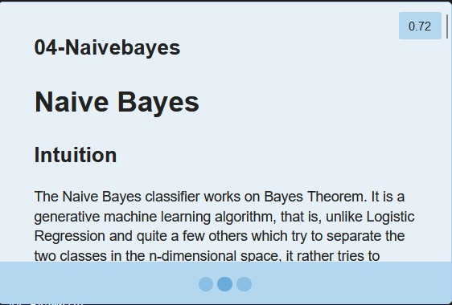
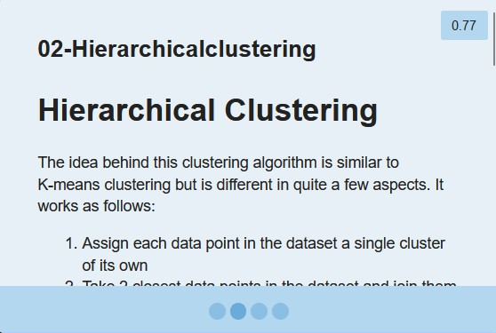

# Intelligent Notes Recall using Browser Extension

Please check [PROPOSAL.md](PROPOSAL.md) for Project Proposal

Please check [PROGRESS REPORT.md](PROGRESS_REPORT.md) for Progress Report

# Video Demo
[YouTube](https://youtu.be/CigO3WNkKYw)

# Installation
If you need to change drive in Anaconda Prompt, just type the DRIVE_LETTER followed by colon to move to D:\ drive type, they cd into the downloaded/cloned path.
```
D:
```

## Django Backend
You'll need Anaconda / Miniconda installed on the system to install all the python dependencies that are needed to use this project. If you do not have Anaconda installed you can install it from the below link. 
 
[Install Anaconda](https://www.anaconda.com/), if not already installed

**Create a new environment using Anaconda Prompt to avoid conflicting packages from in the current environment**
```
conda create -n django python=3.10
```

```
conda activate django
```

Change directory to `/downloaded_path/src/recall`. This is where we can run the Django backend. 

Install all the requirements for the project using the following command,

```
pip install -U -r requirements.txt
```

Ideally, all of the requirements would be installed using this command, if not please install the required package manually

Now, run the Django backend using the following command
```
python manage.py runserver
```

Keep this server running, we'll now install the browser extension to use the application intuitively.

## Firefox Extension
Please install Mozilla Firefox if you don't have it installed from [Mozilla Firefox Download](https://www.mozilla.org/en-US/firefox/new/)

- Go to the URL,
```
about:debugging#/runtime/this-firefox
```

- **Click on Load Temporary Add-On**
- Select `manifest.json` at `/downloaded_path/src/firefox/manifest.json`
- You'll see a Triangle sign besides the menu icon in the top right corner.
- You've successfully installed the Firefox extension

# Usage
- Once the Django backend is up and running and the Firefox extension is installed 
- You can triple click on any paragraph that automatically selects the whole paragraphs and makes a search to the backend

> For the first time making the call to the backend it will download the bert base model with is atleast half gigabytes and will install it but that will only happens once for setting up an environment so practically the user will never experience it. It's part of the setup. Every subsequent call is almost instantaneous depending upon the processing power of the computer.

```
If the application seems stuck after selecting the text, make sure you're triple clicking.
Check the Anaconda Prompt for any processes that might be going on
Check if the Django Backend is running.
```

- The backend will return most relevant notes if one exists else will return empty list.
  - The similarity is determined by the threshold which is saved in `config.json`. 
  - The lower the threshold lower the relevance of the notes.

# Debugging
If you change the hyperparameters in `config.json` file you need to delete the `.faiss` hidden folder created in the root directory of the notes location, in the default case it is at `src/recall/markdown/.faiss`

After this the model will retrain again for the new hyperparameters

## Examples
```
Triple click on these paragraphs to test out the extension. 

Make sure that the Django backend is running and the extension is installed 
on the browser as instructed in the Installation section.
```

> In statistics, naive Bayes classifiers are a family of simple "probabilistic classifiers" based on applying Bayes' theorem with strong independence assumptions between the features. They are among the simplest Bayesian network models, but coupled with kernel density estimation, they can achieve high accuracy levels.

> k-means clustering is a method of vector quantization, originally from signal processing, that aims to partition n observations into k clusters in which each observation belongs to the cluster with the nearest mean (cluster centers or cluster centroid), serving as a prototype of the cluster. 

```
Please note that the results posted below are for a threshold value of 0.7, by default I have shipped the application with 0.5 threshold.
```

# Screenshots
Screenshots for the above examples,

<p>



<center>Example #1: Top Three Results</center>
</p>

<p>


<br>


<center>Example #2: Top Four Results</center>
</p>

# Proposal
Intelligent Notes Recall using Browser Extension, as time passes the percent of information retained from any notes or resource exponentially decreases, so as to combat the forgetting curve frequent recall / revision is utmost important. It uses three main topics taught during the class: **Language Models, Relevant Search and Relevance Feedback.**

## Idea
The idea is to have an intelligent browser extension that reads the current browsing page dynamically and suggests the most related notes from your note-taking application databases. For instance, suppose you're reading an article on "Transformer Neural Networks" then the browser extension will dynamically read the webpage and show the most relevant notes to improve recall from the already saved notes.

## Motivation
I personally take a lot of notes, but the taking notes is not enough, we should be able to re-read the notes once in a while to improve memorization or understanding of the notes. Without which the importance of taking notes drastically decreases. 

This is the main problem that students face when the notes are not reviewed frequently and in an intuitive manner. The Information Retained decreases as the time elapses.

<p style="text-align:center">
Fig.1 - The Forgetting Curve
</p>

To combat this phenomenon the main solution is to keep reviewing the notes frequently so that the % of information retained is maximized.

<p style="text-align:center">
Fig.2 - Combating Forgetting Curve using Intelligent Recall
</p>

**This extension will help with information retention as well as intuitive note-taking.**

## References
- [Combating the Forgetting Curve](https://www.mindtools.com/pages/article/forgetting-curve.htm)
- [FAISS](https://github.com/facebookresearch/faiss)
- [Huggingface](https://huggingface.co/sentence-transformers/bert-base-nli-mean-tokens)

# Team Members
Ashwin Patil `anpatil2@illinois.edu` `SOLO PROJECT`

# Time Report [38 Hours]
## Firefox Extension [14 Hours]
- [x] `2 Hours` Learning extension development
- [x] `7 Hours` Developing extension backend
- [x] `3 Hours` Extension frontend design
- [x] `2 Hours` Connecting extension with django backend using REST APIs

## Django Backend [18 Hours]
- [x] `2 Hours` Developing microservice architecture for backend
- [x] `2 Hours` Exposing REST APIs for extension use, serialization to transfer data.
- [x] `2 Hours` Creating embeddings from Notes using BERT Base
- [x] `4 Hours` Facebook AI Similarity Search (FAISS) for efficient similarity search.
  - [x] `2 Hours` Learning FAISS
  - [x] `2 Hours` Implementing FAISS and exploring hyperparameters.
- [x] `1 Hour` Converting Markdown to HTML for displaying on frontend

## Miscellaneous [6 Hours]
- [x] `4 Hours` Documentation
- [x] `2 Hours` Presentation
